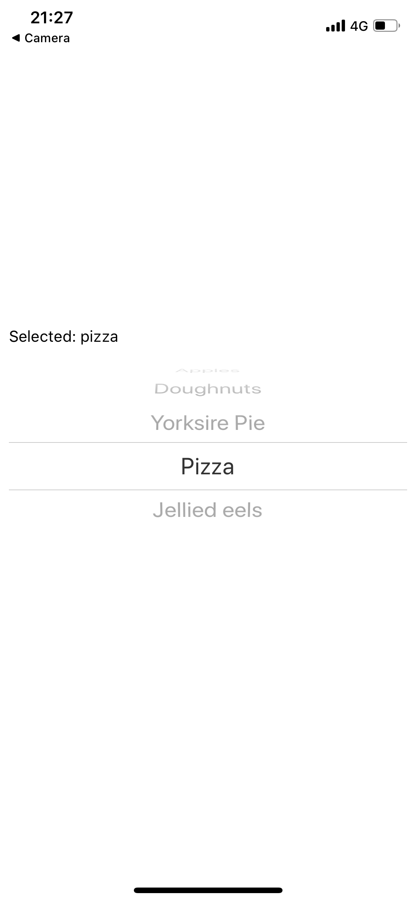
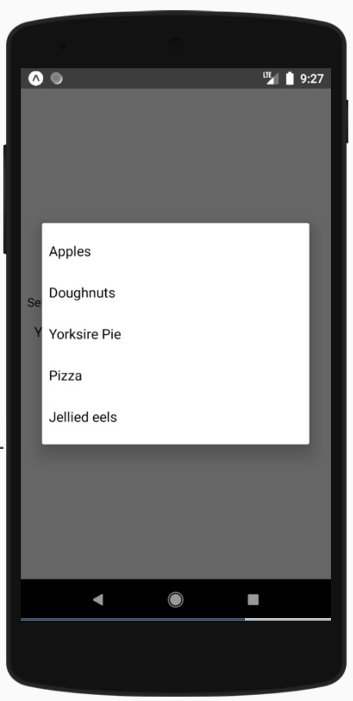

Forms in React Native are just a collection of inputs. Whereas on the web we have a `<form>` element and a submit button, this is not the case in React Native. Let's looks at some of the inputs we have available.

## TextInput

The [TextInput](https://reactnative.dev/docs/textinput) is probably the most common and frequently used text form in React Native. It is actually incredibly powerful and has a many important features.

[🔍 TextInput examples](https://snack.expo.io/@kadikraman/textinput-example)

Here we have 4 examples of what you can do with TextInput:

#### Basic text input

The first input is a basic TextInput with no embellishments. We use 4 props:

- `style` - adding some padding and a border color for the input to be better visible on the screen. The Text Input has no default styles
- `value` - the current value
- `onChangeText` - gets called with the new value whenever the user changes the content of the input
- `placeholder` - some placeholder text to be displayed when the input is empty

#### Number input

Here we use an additional prop called `keyboardType`. You can use [this prop](https://reactnative.dev/docs/textinput#keyboardtype) to define what type of input this is. Since we're working on phones, this will define what type of keyboard the user gets to work with.

The options that work on both iOS and Android are:

- default
- number-pad
- decimal-pad
- numeric
- email-address
- phone-pad

#### Password input

For password inputs we don't want to show what the user has types. For this we can use the `secureTextEntry` prop and set it to true (default is false). This ensures the input displays \*\*\* instead of the actual content.

#### Multiline input

For a multiline input, we use `multiline={true}`. This will allow the input to grow infinitely. If we'd like to cap the height of the input on the page, we can also set it to a specific number of lines, e.g. 4 with `numberOfLines={4}`.

## Picker

The [Picker](https://reactnative.dev/docs/picker) component is an interesting one, because it's looks very different across platforms.

[🔍 Picker example](https://snack.expo.io/@kadikraman/picker-example)

    

        
    

    

        
    

As you can see, the iOS picker is an inline wheel, and the Android picker is a modal! You'll come across these types of UX issues every now and then with React Native. It's great that we can use one codebase to build two fully native apps, but we still have to spend time to learn and explore environment-specific nuances in both platforms.

## Switch

A [Switch](https://reactnative.dev/docs/switch) is essentially a toggle button. Some styling nuances aside, it looks quite similar across platforms.

[🔍 Switch example](https://snack.expo.io/@kadikraman/switch-example)

## Other components

We have now played around with the most important components built into the core React Native library, but there are loads of community components you can install separately and use!

If you want to find some more, head over the [React Native Directory](https://reactnative.directory/) website.
