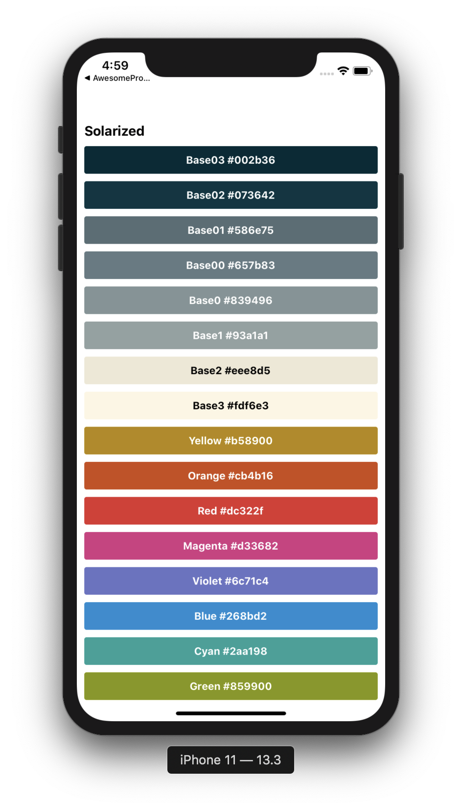
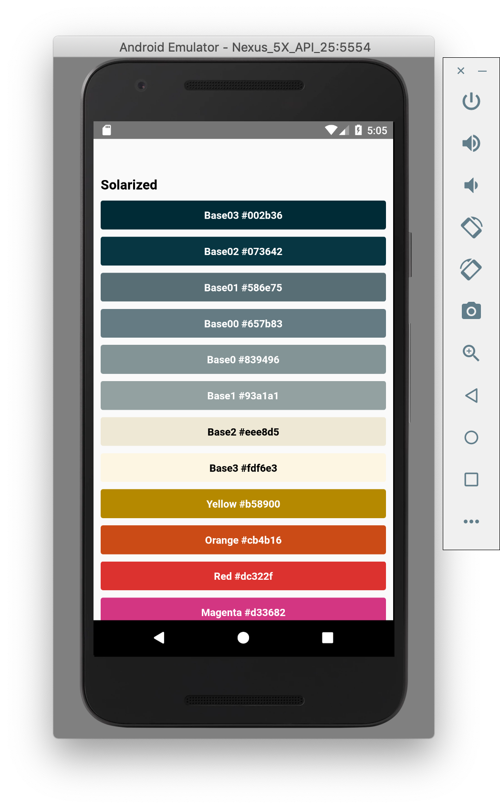

You might have already recognized the colours we were using earlier. They are part of the [Solarized](<https://en.wikipedia.org/wiki/Solarized_(color_scheme)>) color scheme by Ethan Schoonover. The colour palette actually contains 16 colours and next up, we'd like to display them all:

```js
const COLORS = [
  { colorName: 'Base03', hexCode: '#002b36' },
  { colorName: 'Base02', hexCode: '#073642' },
  { colorName: 'Base01', hexCode: '#586e75' },
  { colorName: 'Base00', hexCode: '#657b83' },
  { colorName: 'Base0', hexCode: '#839496' },
  { colorName: 'Base1', hexCode: '#93a1a1' },
  { colorName: 'Base2', hexCode: '#eee8d5' },
  { colorName: 'Base3', hexCode: '#fdf6e3' },
  { colorName: 'Yellow', hexCode: '#b58900' },
  { colorName: 'Orange', hexCode: '#cb4b16' },
  { colorName: 'Red', hexCode: '#dc322f' },
  { colorName: 'Magenta', hexCode: '#d33682' },
  { colorName: 'Violet', hexCode: '#6c71c4' },
  { colorName: 'Blue', hexCode: '#268bd2' },
  { colorName: 'Cyan', hexCode: '#2aa198' },
  { colorName: 'Green', hexCode: '#859900' },
];
```

You should be using FlatList for this.

For extra credit - also display the name of the color in white on the darker colors and in black on the lighter ones!

<div style="display:flex; flex-direction:row">
    <div style="width:400px;margin:0 auto;margin-bottom:21px">
        
    </div>
    <div style="width:400px;margin:0 auto;margin-bottom:21px">
        
    </div>
</div>
