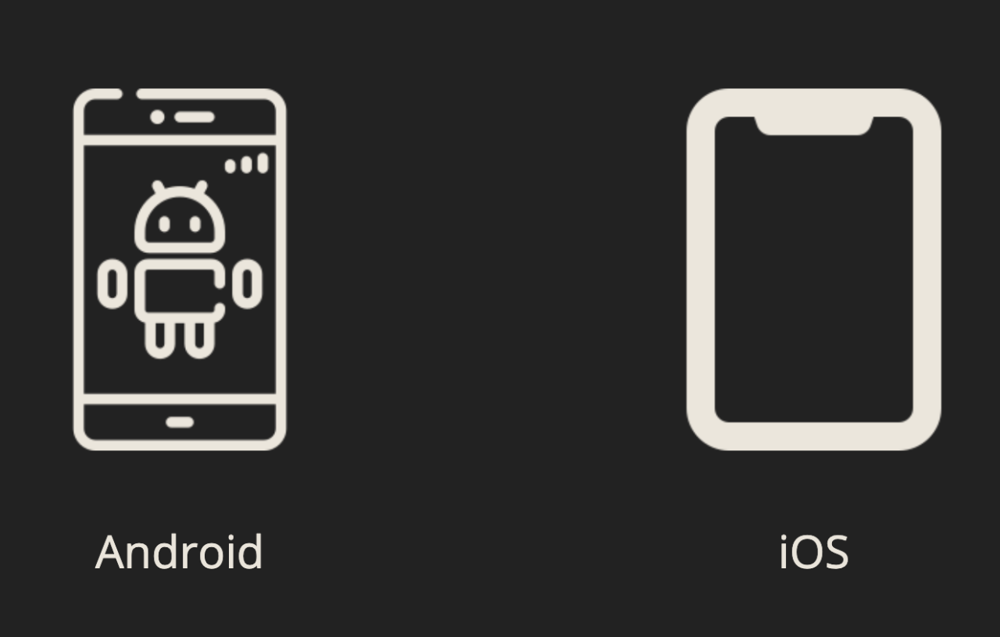
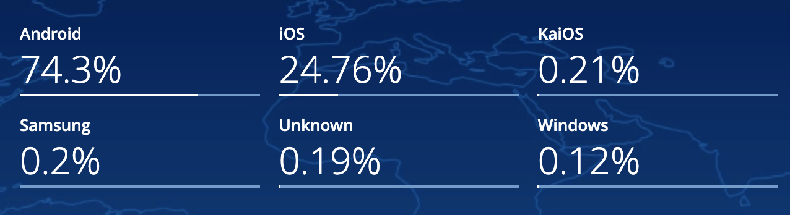
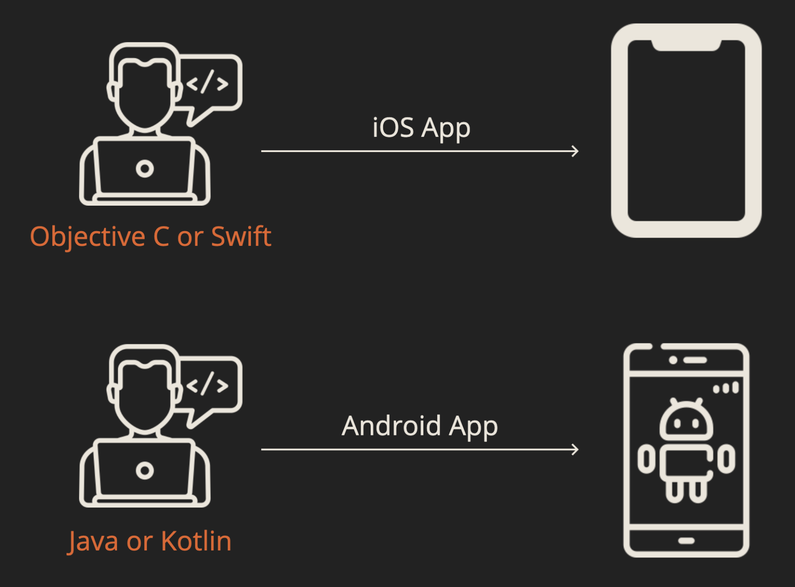
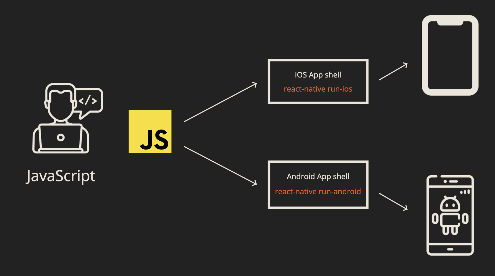
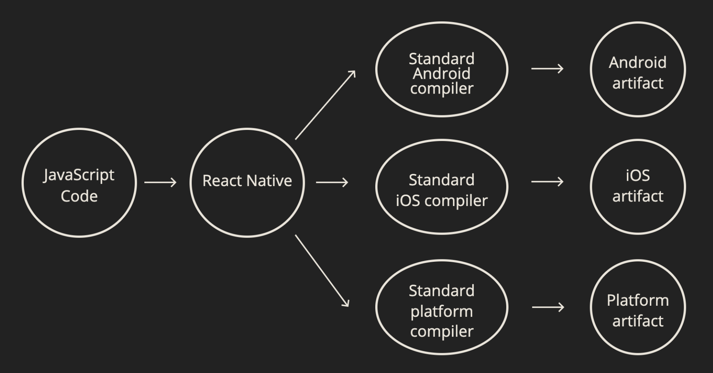

    

Smartphones are really just small computers you can carry around in your pocket. Small, but powerful. An often cited comparison is that the average smartphone these days has a 1 million times more RAM and 7 million times more memory than the guidance computer for Apollo 11 that [landed the first humans on the moon](https://www.realclearscience.com/articles/2019/07/02/your_mobile_phone_vs_apollo_11s_guidance_computer_111026.html)!

Due to their smaller screen and touch-based interface, browsing the web on a smartphone is still often a sub-optimal experience. Progressive Web Apps (PWAs) improve the experience somewhat, but nothing beats a good old native Mobile App designed from the ground up with mobile experience in mind.

In 2020, the number of smartphone users in the world is 3.5 billion, which translates to 45.12% of the world's population owning a smartphone. Looking at the global market share for mobile phones we can see [Android and iOS](gs.statcounter.com/os-market-share/mobile/worldwide) clearly in the lead.

    

Note that this is the _global_ stats and vary significantly per country. For instance, the market share for iOS was 57.3% in the US, 51.6% in the UK, but only 2.1% in India. As a result, which platform you focus most of your energy on should depend on your target audience. It is clear however that if you manage to cover both iOS and Android, you will cover 99% of your audience, no matter the country.

Now, as phones are just tiny computers, they have an operating system, the same way your computer does.

- **Some examples of computers:** MacBook, Dell, Lenovo
- **Some examples of operating systems:** macOS, Windows, Linux
- **Some examples of phones:** iPhone, Samsung Galaxy S20, Nexus 5X
- **Some examples of phone operating systems:** iOS, Android

Applications are designed to run on a particular _operating system_ so you can't just take an iOS app and run it on Android and vice versa. App Store vs Google Play Store aside, the underlying _architecture_ is incompatible.

So in order to target 99% of smartphone users, we'll have to build two apps: one for Android and one for iOS.

    

You can imagine tha hassle this can cause. You'll have to manage two of everything: language, codebases, developer teams, feature sets, release schedules etc. Hiring two developer teams is expensive, and hiring a single team that has in depth knowledge of both Andorid and iOS is almost impossible.

React Native is a platform developed by Facebook for solving this problem. Their goal was to build a platform that enables you to have:

- fully native apps (not webviews/PWAs)
- one codebase
- one development team
- one language
- fully extensible (you should be anything that is possible without using React Native)

    

The language of choice ended up being JavaScript probably because React (the popular frontend framework also developed by Facebook) is a JavaScript framework, so it provides the smallest possible learning curve for folks already familiar with React.

Note: React Native is not the only such framework, and it's not even the first, but it is definitely the easiest one for web/JavaScript developers to pick up!

## How does it work?

Without getting overly technical here, React Native is built in such a way that it targets existing compilers. For example, we have compilers that accept Java / Kotlin code and target Android platform, or Objective C / Swift targeting iOS platform. This is really powerful, because

1. Native compilers are _designed_ for this, so we'll be no worse than non-React Native apps, and
2. This makes the React Native framework infinitely extensible. React Native Windows? VR? Web? It could all be available from our one unified JavaScript API.

    

Source: https://hackernoon.com/understanding-react-native-bridge-concept-e9526066ddb8