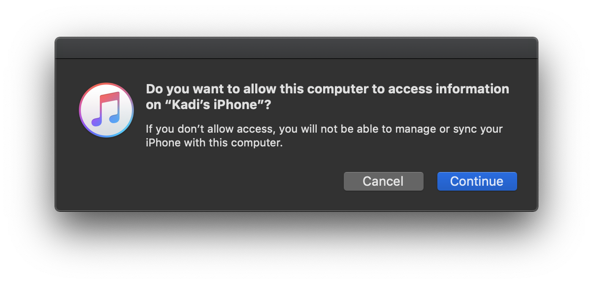
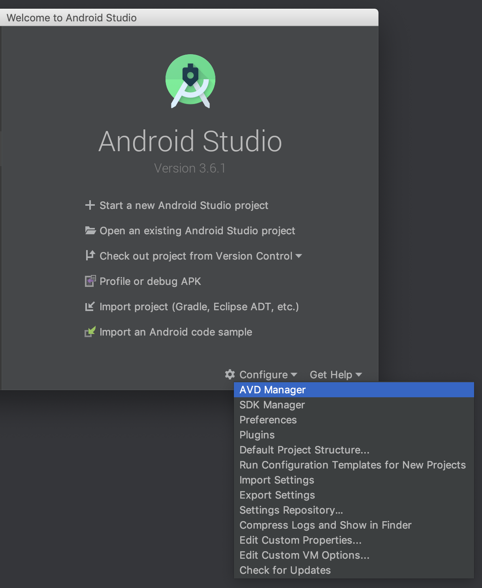

If you are already familiar with mobile development (or if you can't or don't want to use Expo), you may want to use the React Native CLI. This requires Android Studio or XCode in order to get started. If you already have these installed, you should be up and running within minutes. If not, you should expect to spend an hour or so on installing and configuring them.

**Note!** If you are using a Windows or Linux machine, you won't be able to build the iOS device, but you can build the Android app. This is why a lot of React Native developers end up using MacBook Pros, since this way you can work on both native apps are the same time. If you want to test on your own iOS device but you don't have a Mac, you may want to look into using Expo instead.

For getting started, follow the React Native CLI quickstart in the [getting started guide](https://reactnative.dev/docs/getting-started) until the section titled **"Creating a New Application"**. If you are on a Mac, you may want to choose iOS for this workshop, as the setup tends to be easier than Android on a Mac. Once you're done, let's pick up from "Creating a New Application" together.

## Creating a New Application

Now that we've got all the environment prep out of the way, let's get started and create our application. Open your terminal and run:

```sh
npx react-native init AwesomeProject
```

Here, `npx` is a command line utility that's bundled with npm (installed with Node.js) and allows you to run command line programs from npm without globally installing them. `react-native init AwesomeProject` tells the cli tool to create a new project called AwesomeProject. You can use a different name if you prefer.

Now it's time to run the project! For native projects, we need to do two things:

1. start the packager that inserts our JavaScript code into our app
2. build the native app

First, lets start the packager:

```sh
cd AwesomeProject
npm run start
```

You can omit this step if you want, since the run command does also open a new window with and starts packager automatically, but I always do it explicitly, since I like knowing that the packager is up to.

### iOS - running on a simulator

Open a new terminal window and navigate back to AwesomeProject and run:

```sh
npx react-native run-ios
```

This usually takes a little while to build, but once done it'll open your default simulator.

### iOS - specifying a simulator

The `run-ios` command will always launch the app on your default simulator. However you might want to test your app on a different simulator. To do this, you can use the `--simulator` command line argument. For example to run run the app on your iPhone XR simulator, you can do the following:

```bash
npx react-native run-ios --simulator="iPhone XR"
```

### iOS - running on a device

First, connect your phone to your MacBook. If you've never done this before, you should get a prompt from iTunes permission dialog:

<div style="width:500px;margin:0 auto;margin-bottom:20px">
    
</div>

After you click "continue", you should get an alert on your phone asking you to confirm. If you missed the alerts or pressed "no" by accident, just unplug and plug in your phone again to be re-prompted.

Now you'll need to find you your phone's name. To do this, open your terminal (with the phone plugged in) and do:

```sh
instruments -s devices
```

This will list all the devices (real and simulated) available on your computer. I never change my phone's name, so it's set at the default: "Kadi’s iPhone" (notice the fancy `’` - this is important).

Now open the terminal in your project root directory (inside AwesomeProject) and run

```sh
npx react-native run-ios --device="Kadi’s iPhone"
```

Where "Kadi’s iPhone" is the name of your phone. Note that this will take a little while to build, and you have to make sure your device is unlocked while the installation is taking place.

### Android - running on an emulator

First, we need to open an emulator. iOS simulator gets opened automatically, but for Android you'll have to do it yourself. Open Android Studio, click on the "Configure" option and choose "AVD Manager". AVD stands for "Android Virutal Device" and this is the menu where you can install, delete, edit and run emulators from.

<div style="width:500px;margin:0 auto;margin-bottom:20px">
    
</div>

Here you can create a new virtual device if you don't have on yet. Once you have a device, double click on it to launch.

Now that the emulator is running, open a new terminal window, navigate back to AwesomeProject and run:

```sh
npx react-native run-android
```

That's it! You're now up and running on your android device.

### Android - running on a device

In order to run your app on your device:

1. close the Android emulator (if you had it open)
2. plug in your phone via USB
3. enable USB debugging\*

**\*** To enable USB debugging on your device, you will first need to enable the "Developer options" menu by going to Settings → About phone and then tapping the Build number row at the bottom seven times. You can then go back to Settings → Developer options to enable "USB debugging".

For any platform-specific issues and nuances, consult the [documentation](https://reactnative.dev/docs/running-on-device).

### Emulator vs Simulator

You may have noticed we've been saying "iPhone Simulator" and "Android Emulator". This is intentional. The difference between emulators and simulators is that emulators mimic the software and hardware environments found on actual devices. Simulators, on the other hand, only mimic the software environment; they otherwise have access to all of the host system's hardware resources such as disk space, memory and processor speed. This means that on Android Emulators, you can be reasonably confident that the physical device will act similarly to the emulator. iPhone simulators however are free from hardware constraints such as running out of memory. This is why it's important to test your iPhone app on a real device if at all possible before publishing to the store.

// TODO look into folder structure
