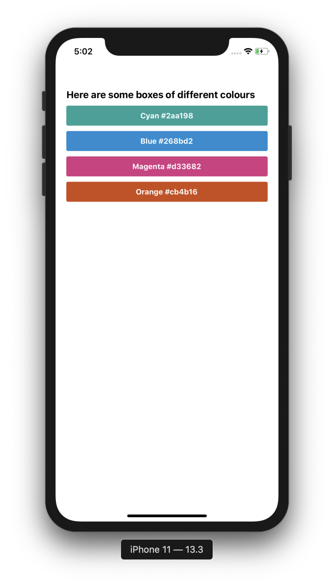
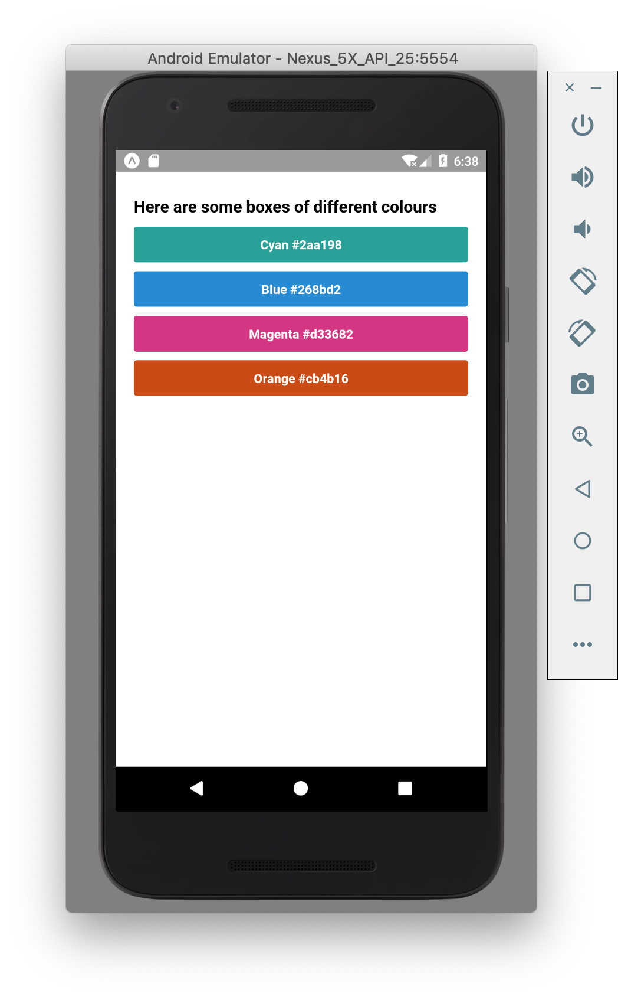

The best way to learn is by doing so let's start off by adding some colour. Here's a little app I built, showcasing come of my favourite colours. Try to recreate it! Here are the colours I used:

```
Cyan: #2aa198
Blue: #268bd2
Magenta: #d33682
Orange: #cb4b16
```

<div style="display:flex; flex-direction:row">
    <div style="width:400px;margin:0 auto;margin-bottom:20px">
        
    </div>
    <div style="width:400px;margin:0 auto;margin-bottom:20px">
        
    </div>
</div>

## Styling Exercise Solution 👀

First thing we want to do is add the new text. Since we already have some text on the page, we can do this by replacing the copy for our "Hello, world!" message and adding the style:

```js
// replace "hello world" text and add style prop

<Text style={styles.heading}>Here are some boxes of different colours</Text>
```

```js
// place this in the stylesheet, under the container style

heading: {
  fontSize: 18,
  fontWeight: 'bold',
  marginBottom: 10,
}
```

Now for lets add a box for cyan. For this we need to add a new `View` and a `Text` with styles. One thing to note about styling in React Native is that all elements have `display: flex` applies by default so all positioning should be done using felxBox. If you're new to flexBox, here are some resources TODO: link to flexbox froggy and flex documentation.

You can use `justifyContent: 'center'` and `alignItems: 'center'` on the parent element to center content both horizontally and vertically.

```js
<View style={styles.cyanBox}>
  <Text style={styles.text}>Cyan #2aa198</Text>
</View>
```

```js
text: {
  fontWeight: 'bold',
  color: 'white'
},
cyanBox: {
  padding: 10,
  borderRadius: 3,
  justifyContent: 'center',
  alignItems: 'center',
  marginBottom: 10,
  backgroundColor: '#2aa198'
}
```

Looking good! Let's add the blue box as well. Your `App.js` now looks something like this:

```js
// App.js

import React from 'react';
import { View, Text, SafeAreaView, StyleSheet } from 'react-native';

const App = () => {
  return (
    <SafeAreaView>
      <View style={styles.container}>
        <Text style={styles.heading}>
          Here are some boxes of different colours
        </Text>
        <View style={styles.cyanBox}>
          <Text style={styles.text}>Cyan #2aa198</Text>
        </View>
        <View style={styles.blueBox}>
          <Text style={styles.text}>Blue #268bd2</Text>
        </View>
      </View>
    </SafeAreaView>
  );
};

const styles = StyleSheet.create({
  container: {
    padding: 10,
  },
  heading: {
    fontSize: 18,
    fontWeight: 'bold',
    marginBottom: 10,
  },
  text: {
    fontWeight: 'bold',
    color: 'white',
  },
  cyanBox: {
    padding: 10,
    borderRadius: 3,
    justifyContent: 'center',
    alignItems: 'center',
    marginBottom: 10,
    backgroundColor: '#2aa198',
  },
  blueBox: {
    padding: 10,
    borderRadius: 3,
    justifyContent: 'center',
    alignItems: 'center',
    marginBottom: 10,
    backgroundColor: '#268bd2',
  },
});

export default App;
```

This is looking good, but you might have noticed there are a lot of repeated styles between the two boxes and this can get cumbersome pretty quickly. Thankfully there is a way around this. The `style` prop also accepts an _array_ of styles, so instead of `style={styles.cyanBox}` we could pass in two sets of styles: `style={[styles.box, styles.cyan]}`.

```js
<View style={[styles.box, styles.cyan]}>
    <Text style={styles.text}>Cyan #2aa198</Text>
</View>
<View style={[styles.box, styles.blue]}>
    <Text style={styles.text}>Blue #268bd2</Text>
</View>
```

```js
box: {
  padding: 10,
  borderRadius: 3,
  justifyContent: 'center',
  alignItems: 'center',
  marginBottom: 10,
},
cyan: {
  backgroundColor: '#2aa198'
},
blue: {
  backgroundColor: '#268bd2'
},
```

Finally add the remaining colours. The finished code should look something like this. (TODO: link to example app)
